# Counter App: Clustered Deployment (Docker Swarm + Kubernetes k3s) and Load Testing Report

Author: CheikhEbeoumar  
Date: 2026-01-11

This report documents:
- Setting up a private Docker registry (Part 1, Part 2 with HTTPS + auth)
- Docker Swarm orchestration (Part 3) and Swarm stack deployment (Part 4)
- Clustered deployment of the Counter app with 4 Flask instances
- Load testing results comparing 1 vs 4 replicas
- Database replication considerations and solutions (Redis Sentinel/Cluster)
- Kubernetes (k3s) manifests for the clustered app
- All commands to reproduce, plus screenshots

---

## Table of Contents

1. Prerequisites  
2. Part 1 — Docker Registry for Linux (External Storage)  
3. Part 2 — Secured Registry (HTTPS + Authentication)  
4. Part 3 — Docker Orchestration Hands-on Lab (Swarm)  
5. Part 4 — Swarm Stack Introduction  
6. Clustered Counter App in Swarm (4 Flask instances)  
7. Load Testing Methodology and Results  
8. Database Replication: Issues and Solutions  
9. Kubernetes (k3s) Clustered Deployment  
10. Differences: Swarm vs Kubernetes  
11. Repository Structure  
12. Screenshots  

---

## 1. Prerequisites

- Docker installed
- Play-with-Docker (PWD) or a multi-node Docker environment for Swarm
- A Docker registry (Docker Hub or the secured local registry in Parts 1–2)
- Python 3.11+ (optional, if running Locust locally)
- kubectl installed
- k3s or k3d installed (for local Kubernetes)

---

## 2. Part 1 — Docker Registry for Linux (External Storage)

Goal: Run a local registry, push `hello-world`, and show storage on host.

Key commands:
```bash
docker run -d --name registry -p 5000:5000 registry:2
docker pull hello-world
docker tag hello-world localhost:5000/hello-world:latest
docker push localhost:5000/hello-world:latest
curl http://localhost:5000/v2/_catalog
curl http://localhost:5000/v2/hello-world/tags/list

mkdir -p /mnt/registry
docker stop registry && docker rm registry
docker run -d --name registry -p 5000:5000 -v /mnt/registry:/var/lib/registry registry:2
docker push localhost:5000/hello-world:latest
find /mnt/registry -type f | sort
```

Screenshots:
- 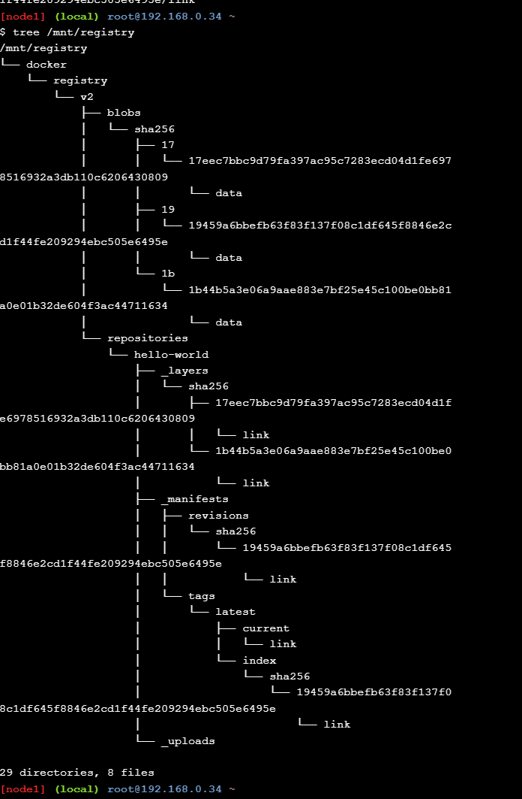
- 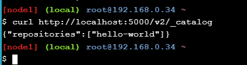

---

## 3. Part 2 — Secured Registry (HTTPS + Authentication)

Goal: Run registry with TLS and basic auth; show successful and failed auth.

Highlights:
- Use SAN-enabled self-signed cert (required by Docker)
- Trust cert for Docker client (/etc/docker/certs.d/HOST:PORT/ca.crt) and system CA store
- Create htpasswd and run registry with TLS+auth

Key commands:
```bash
# Create SAN cert via openssl config; trust for Docker + CA store
htpasswd -Bbn testuser testpassword > auth/htpasswd

docker run -d --name registry -p 5000:5000 \
  -v "$(pwd)"/certs:/certs -v "$(pwd)"/auth:/auth \
  -e REGISTRY_HTTP_TLS_CERTIFICATE=/certs/domain.crt \
  -e REGISTRY_HTTP_TLS_KEY=/certs/domain.key \
  -e REGISTRY_AUTH=htpasswd \
  -e REGISTRY_AUTH_HTPASSWD_REALM="Registry Realm" \
  -e REGISTRY_AUTH_HTPASSWD_PATH=/auth/htpasswd \
  registry:2

# HTTPS unauthenticated -> 401
curl -v https://<HOST>:5000/v2/_catalog

# Authenticated -> success
curl -u testuser:testpassword https://<HOST>:5000/v2/_catalog

# Docker login success + failure
docker login <HOST>:5000 -u testuser -p testpassword
docker logout <HOST>:5000
docker login <HOST>:5000 -u testuser -p wrongpassword

# Push over HTTPS and verify tag
docker tag hello-world <HOST>:5000/hello-world:secure
docker push <HOST>:5000/hello-world:secure
curl -u testuser:testpassword https://<HOST>:5000/v2/hello-world/tags/list
```

Screenshots:
- 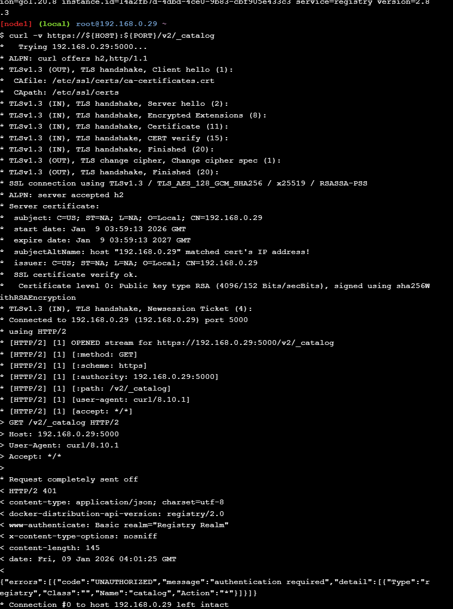
- 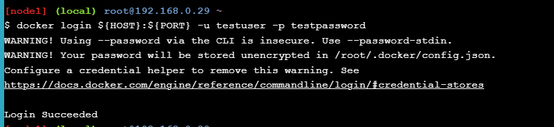
- 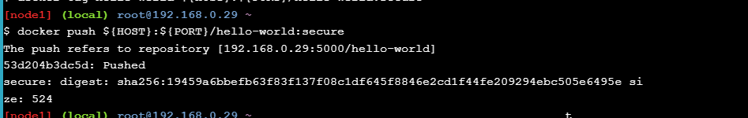

---

## 4. Part 3 — Docker Orchestration Hands-on Lab (Swarm)

Goal: Create 3-node Swarm, deploy service, Drain a node, restore Active.

Key commands:
```bash
docker swarm init --advertise-addr $(hostname -i)
# Join workers on node2 and node3 via the token
docker node ls

docker service create --name web --replicas 3 -p 8080:80 nginx:alpine
docker service ls
docker service ps web

docker node update --availability drain <NODE2_ID>
docker node ls
docker service ps web

docker node update --availability active <NODE2_ID>
docker node ls

# Reschedule tasks to the restored node
docker service update --force web
# or scale: docker service scale web=6 && docker service scale web=3
docker service ps web
```

Screenshots:
- 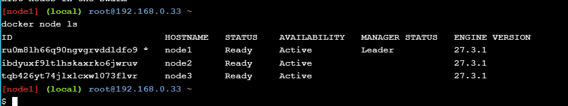
- 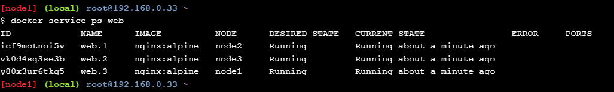

Finding: After switching a node from Drain to Active, tasks do NOT automatically return. Use `docker service update --force` or scale to reschedule.

---

## 5. Part 4 — Swarm Stack Introduction

Goal: Deploy a stack via docker-compose with replicas and healthcheck.

docker-compose.yml (excerpt):
```yaml
version: '3.8'
services:
  web:
    image: nginx:alpine
    ports:
      - "8080:80"
    deploy:
      replicas: 3            # replicas configured here
    healthcheck:
      test: ["CMD","wget","-q","--spider","http://localhost"]
      interval: 30s
      timeout: 10s
      retries: 3
      start_period: 40s
    networks: [webnet]
networks:
  webnet:
    driver: overlay
```

Key commands:
```bash
docker stack deploy -c docker-compose.yml mystack
docker stack ls
docker stack services mystack
docker stack ps mystack
docker service ps mystack_web
```

Screenshots:
- 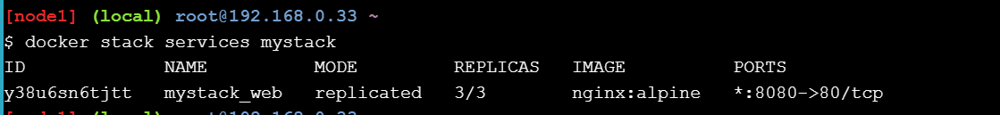
- 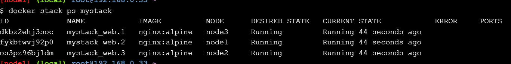
- 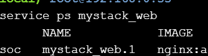
- 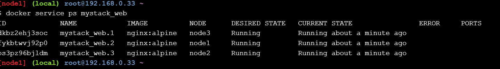

---

## 6. Clustered Counter App in Swarm (4 Flask instances)

Goal: Deploy the Counter app with 4 Flask replicas and Redis backend.

docker-compose.swarm.yml:
```yaml
version: '3.8'
services:
  api:
    image: <YOUR_DOCKERHUB_USERNAME>/flask-counter:latest
    ports: ["5000:5000"]
    environment: ["REDIS_HOST=redis","REDIS_PORT=6379"]
    deploy:
      replicas: 4
      update_config: { parallelism: 2, delay: 10s }
      restart_policy: { condition: on-failure, delay: 5s, max_attempts: 3 }
      resources:
        limits: { cpus: '0.5', memory: 256M }
        reservations: { cpus: '0.25', memory: 128M }
    healthcheck:
      test: ["CMD-SHELL","curl -f http://localhost:5000/health || exit 1"]
      interval: 30s
      timeout: 10s
      retries: 3
      start_period: 40s
    networks: [counter-net]
    depends_on: [redis]
  redis:
    image: redis:7-alpine
    deploy:
      replicas: 1
      placement:
        constraints: ["node.role == manager"]
    volumes: ["redis-data:/data"]
    networks: [counter-net]
    healthcheck:
      test: ["CMD","redis-cli","ping"]
      interval: 10s
      timeout: 5s
      retries: 3
volumes:
  redis-data:
networks:
  counter-net:
    driver: overlay
```

Deployment:
```bash
docker network create --driver overlay counter-net
docker stack deploy -c docker-compose.swarm.yml counter
docker stack services counter
docker service ps counter_api
```

---

## 7. Load Testing Methodology and Results

Locust script:
```python
from locust import HttpUser, task, between
class CounterUser(HttpUser):
    wait_time = between(0.5, 2.0)
    @task(5)
    def root(self): self.client.get("/")
    @task(1)
    def health(self): self.client.get("/health")
```

Headless runs:
```bash
# 1 replica
docker service scale counter_api=1
locust -f locustfile.py --host http://<MANAGER-IP>:5000 \
  --users 100 --spawn-rate 10 --run-time 2m \
  --html results_swarm_1replica.html --csv results_swarm_1replica --headless

# 4 replicas
docker service scale counter_api=4
locust -f locustfile.py --host http://<MANAGER-IP>:5000 \
  --users 100 --spawn-rate 10 --run-time 2m \
  --html results_swarm_4replicas.html --csv results_swarm_4replicas --headless
```

Record (fill with your numbers):
- 1 replica: RPS …; Avg latency … ms; p95/p99 …/… ms
- 4 replicas: RPS …; Avg latency … ms; p95/p99 …/… ms

Conclusion: Capacity increased/decreased (justify with metrics).

---

## 8. Database Replication: Issues and Solutions

When scaling Redis via `docker service scale counter_redis=3`, issues arise:
- Inconsistent counters (split-brain)
- Volume conflicts
- No master election

Solutions:
- Redis Sentinel (single master, replicas, automatic failover)
- Redis Cluster (sharding, client support)
- Managed DB (ElastiCache, etc.)

Example Sentinel compose is included in repo to illustrate HA approach.

---

## 9. Kubernetes (k3s) Clustered Deployment

Recommended local setup with k3d:
```bash
curl -s https://raw.githubusercontent.com/k3d-io/k3d/main/install.sh | bash
k3d cluster create counter --agents 1 -p "8080:80@loadbalancer"
kubectl config use-context k3d-counter
kubectl get nodes
```

Apply manifests:
```bash
kubectl apply -f k8s/namespace.yaml
kubectl apply -f k8s/redis-deployment.yaml
kubectl apply -f k8s/flask-deployment.yaml
kubectl apply -f k8s/hpa.yaml
kubectl get all -n flask-counter
```

Access:
```bash
curl http://localhost:8080/
```

---

## 10. Differences: Swarm vs Kubernetes

- Replicas: Swarm `deploy.replicas` vs K8s `Deployment.spec.replicas`
- Health: Swarm `healthcheck` vs K8s `livenessProbe` + `readinessProbe`
- Autoscaling: Swarm manual vs K8s HPA
- Storage: Swarm volumes vs K8s PVC/PV
- Networking: Swarm overlay vs K8s Services/Ingress
- Scheduling: Swarm placement constraints vs K8s affinity/taints/tolerations

---

## 11. Repository Structure

```
.
├── images/
│   ├── part1-1.png
│   ├── part1-2.png
│   ├── part2-1.png
│   ├── part2-2.png
│   ├── part2-3.png
│   ├── part3-1.png
│   ├── part3-2.png
│   ├── part4-1.png
│   ├── part4-2.png
│   ├── part4-3.png
│   └── part4-4.png
├── k8s/
│   ├── namespace.yaml
│   ├── redis-deployment.yaml
│   ├── flask-deployment.yaml
│   └── hpa.yaml
├── docker-compose.swarm.yml
├── locustfile.py
├── Dockerfile
├── app.py
└── README.md
```

---

## 12. Screenshots

- Part 1:
  - 
  - 

- Part 2:
  - 
  - 
  - 

- Part 3:
  - 
  - 

- Part 4:
  - 
  - 
  - 
  - 

---

## 13. References

- Docker Registry: https://docs.docker.com/registry/
- Play-with-Docker Labs:
  - Registry Part 1: https://training.play-with-docker.com/linux-registry-part1/
  - Registry Part 2: https://training.play-with-docker.com/linux-registry-part2/
  - Orchestration HOL: https://training.play-with-docker.com/orchestration-hol/
  - Swarm Stack Intro: https://training.play-with-docker.com/swarm-stack-intro/
- Redis Sentinel: https://redis.io/docs/management/sentinel/
- Locust: https://docs.locust.io/
- k3s: https://k3s.io/
- k3d: https://k3d.io/